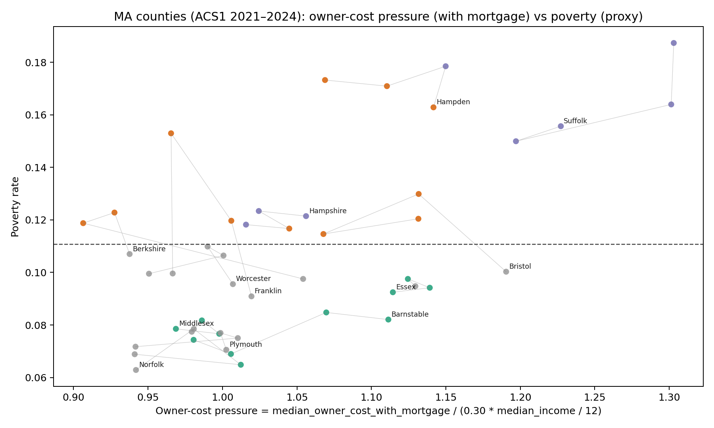
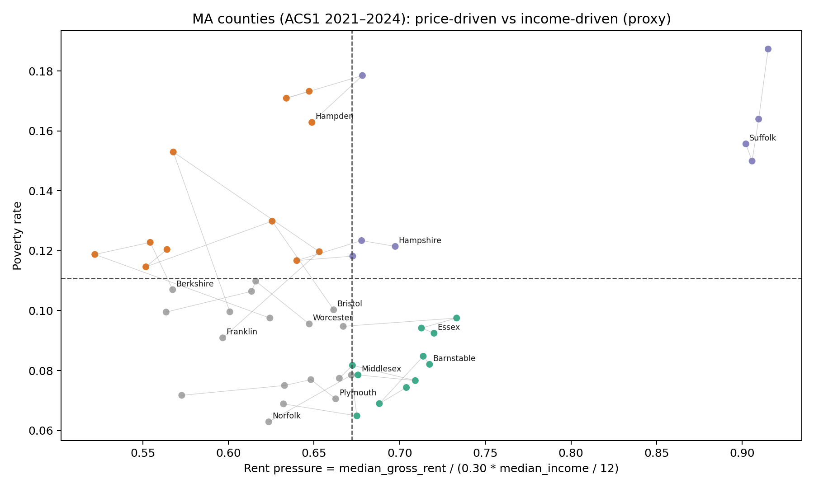
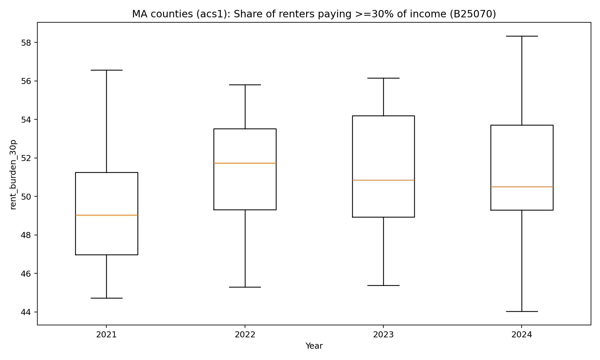
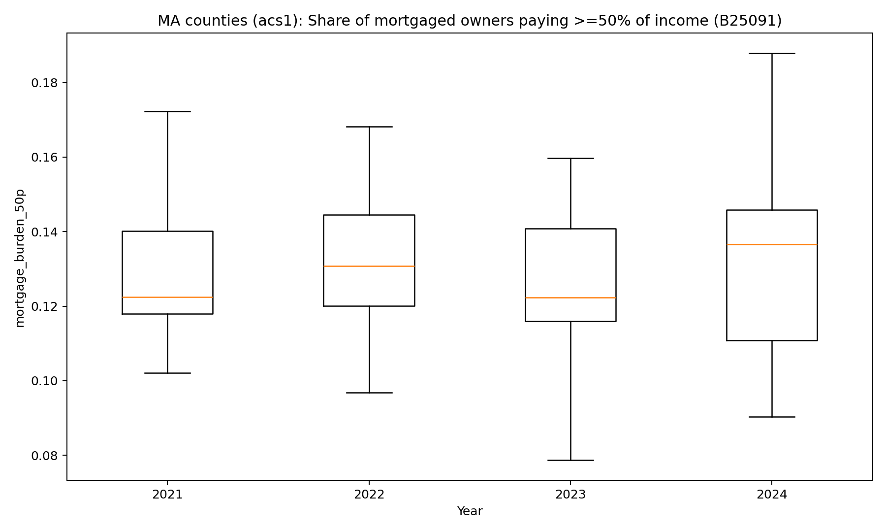

# Massachusetts Census (ACS) 2024 -> Tableau

This folder contains a small downloader/formatter for U.S. Census **ACS 2024 5-year** estimates
(vintage `2024`, i.e. 2020-2024) for geographies within **Massachusetts (state FIPS 25)**.

Outputs are designed for Tableau:

- `*_wide.csv`: one row per geography, many columns (estimates + MOEs + a few derived rates)
- `*_long.csv`: one row per (geography, variable), easier for pivoting
- `data_dictionary.csv`: variable labels/concepts for tooltips and metadata joins

## Run

```bash
python3 src/download_ma_acs_2024.py
```

Optional (recommended if you have one):

```bash
export CENSUS_API_KEY="...your key..."
python3 src/download_ma_acs_2024.py --key "$CENSUS_API_KEY"
```

By default, it downloads:

- `county`
- `place`
- `tract`

Block groups are optional because they are much larger:

```bash
python3 src/download_ma_acs_2024.py --include-block-groups
```

## Notes

- Source API: `https://api.census.gov/data/2024/acs/acs5`
- The ACS "2024 5-year" product is the 2020-2024 period, but Census API vintage is `2024`.

## 2020–2024 time series (county)

This produces a Tableau-friendly time series you can use for correlation analysis.

Run:

```bash
python3 src/download_ma_acs_2020_2024_timeseries.py
```

Output:

- `out/ma_acs_2020_2024_county_timeseries_wide.csv`

Notes:
- For 2021–2024, the script uses `acs1` (1-year estimates).
- For 2020, it uses `acs5` by default because standard 2020 ACS 1-year estimates are not available on the Census API.
- Use `--acs5-all-years` if you prefer consistent rolling 5-year estimates across the whole period.

### Tableau dashboard ideas (correlations)

Suggested worksheets:
- Scatter: `poverty_rate` vs `B19013_001E` (median household income), color by `year`, label by `NAME`.
- Scatter: `B25077_001E` (median home value) vs `B19013_001E`.
- Scatter: `B25064_001E` (median gross rent) vs `poverty_rate`.
- Trend: `year` on Columns, metrics on Rows (`B19013_001E`, `poverty_rate`, `owner_rate`).

Suggested dashboard controls:
- Filters: `year`, `NAME` (county), and `dataset` (acs1 vs acs5).
- Add trend lines (Analytics pane) on scatter plots to visualize correlation.

## 📊 Dataset Context & Key Metrics

This dataset is not an official pre-built Census analysis. Instead, it is raw ACS data extracted and dynamically reshaped by our Python scripts specifically for Tableau dashboarding (e.g., `download_ma_acs_2020_2024_timeseries.py`). 

Below is an explanation of the core housing metrics calculated within this pipeline:

* **Gross Rent (`median_gross_rent_est`)** 
  * *Source Variable:* ACS `B25064_001`
  * *Definition:* Focuses strictly on occupied rental units paying cash rent. It represents the renter's monthly rent *plus* the estimated monthly cost of utilities (if the tenant is responsible for paying them).

* **Tenure Status (Owner vs. Renter)**
  * *Source Variables:* ACS `B25003_002` (Owner), `B25003_003` (Renter), `B25003_001` (Universe)
  * *Definition:* Measures the split of occupied housing units (excluding vacant properties or un-lived-in investment properties). 
  * *Derived Metrics:* `owner_rate` and `renter_rate` represent the share of total occupied units belonging to each respective category.

* **Mortgage Share (`mortgage_share`)**
  * *Source Variables:* Derived from ACS `B25081`
  * *Definition:* The percentage of owner-occupied housing units that currently have a mortgage or similar debt (`with_mortgage_est` / `mortgage_status_universe_est`).

## 📈 Generated Visualizations

Here is a look at some of the correlation plots generated by our pipeline.

### Owner Cost Pressure vs. Poverty


### MA Price vs Income Quadrants


### Rent/Mortgage Burden Boxplots



